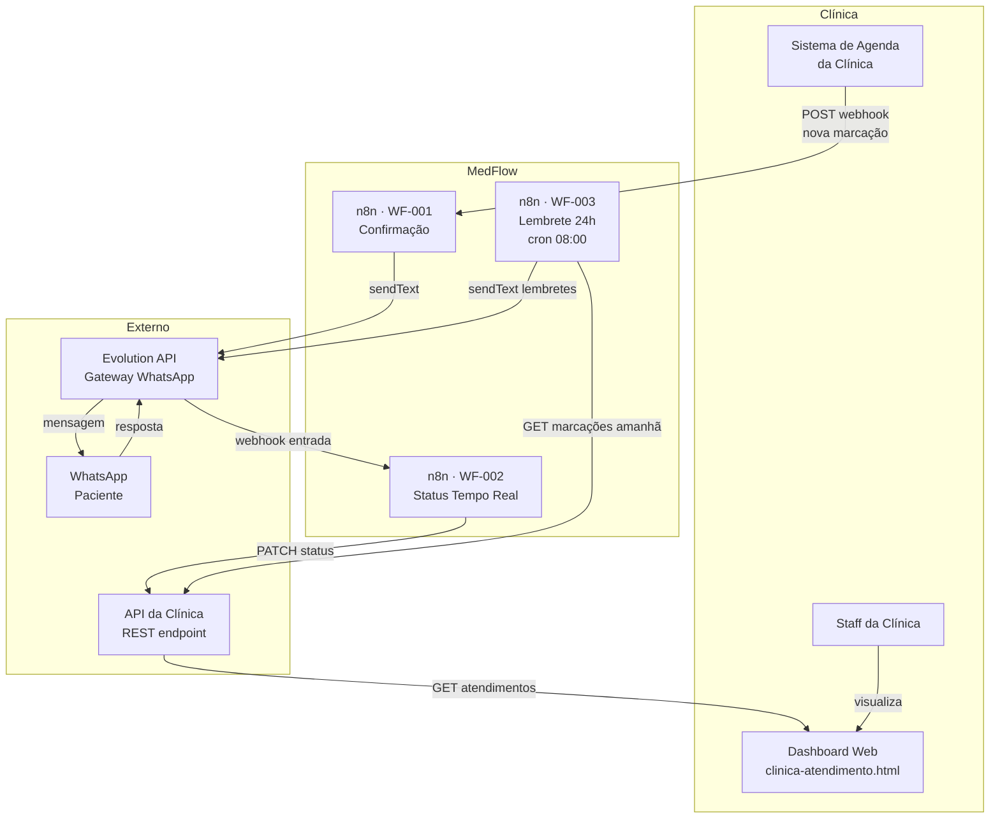
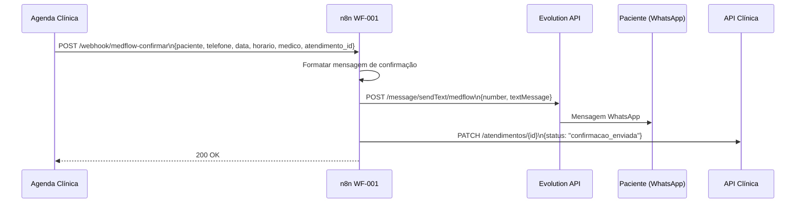
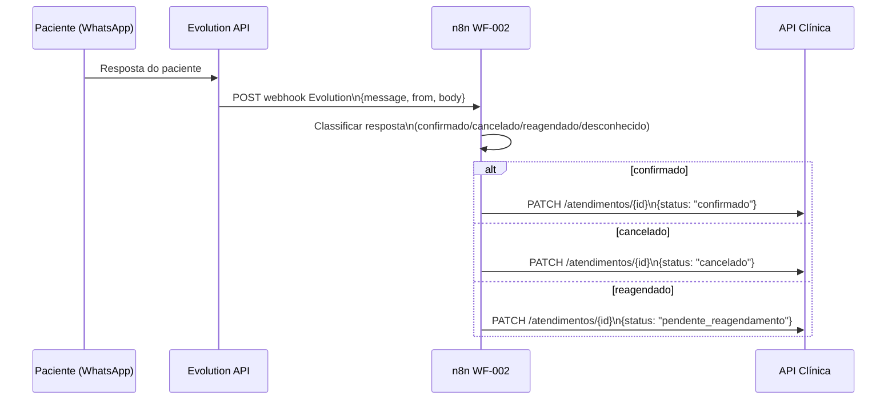
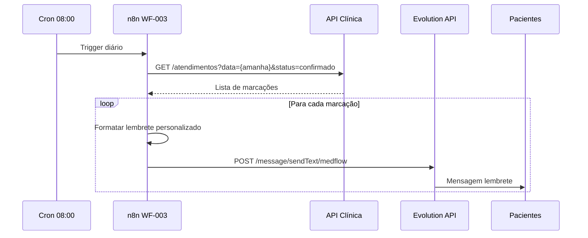

# Arquitectura — MedFlow

**Data:** 2026-03-27

---

## Visão Geral

O MedFlow é um sistema de automação de fluxo de trabalho baseado em n8n, sem base de dados própria. O estado dos atendimentos vive na API da clínica. Os workflows são desencadeados por webhooks ou por cron e comunicam com o paciente exclusivamente via WhatsApp (Evolution API).

---

## Diagrama de Componentes

---

## Fluxo de Dados — WF-001 (Confirmação)

---

## Fluxo de Dados — WF-002 (Status em Tempo Real)

---

## Fluxo de Dados — WF-003 (Lembrete 24h)

---

## Decisões de Design

| Decisão | Razão |
|---------|-------|
| Sem base de dados própria | O estado dos atendimentos já existe na API da clínica; duplicar seria fonte de inconsistências |
| Dashboard HTML estático | Sem necessidade de backend próprio; o dashboard consome a API da clínica directamente |
| Evolution API para WhatsApp | API estável, auto-hospedável, compatível com n8n via HTTP Request |
| n8n como motor | Workflows visíveis e editáveis pelo operador sem código; portabilidade garantida por JSON export |

---

## Variáveis de Ambiente

| Variável | Descrição |
|----------|-----------|
| `EVOLUTION_API_URL` | Base URL da instância Evolution API |
| `EVOLUTION_API_KEY` | API key da instância |
| `EVOLUTION_INSTANCE` | Nome da instância WhatsApp (ex: `medflow`) |
| `MEDFLOW_API_URL` | Base URL da API da clínica |
| `MEDFLOW_API_TOKEN` | Token de autenticação da API da clínica |
